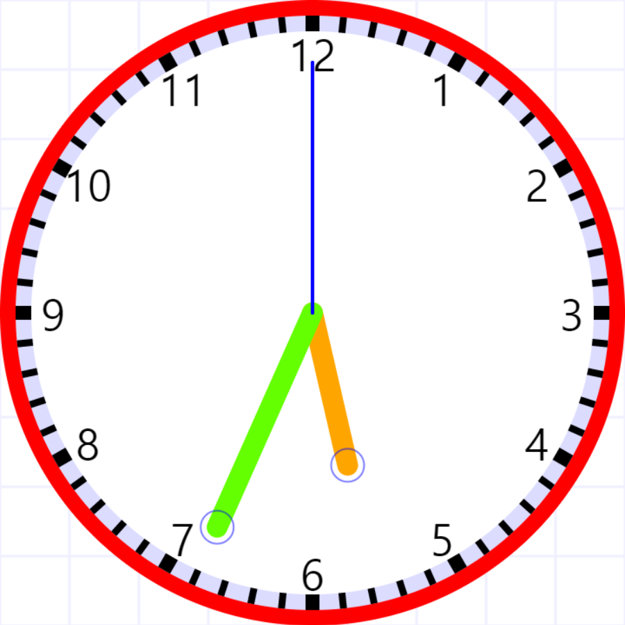
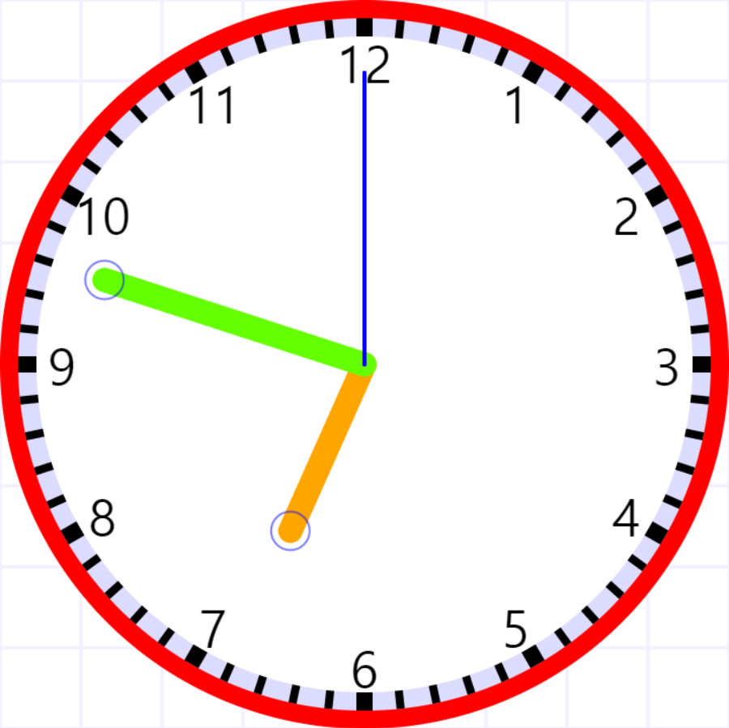
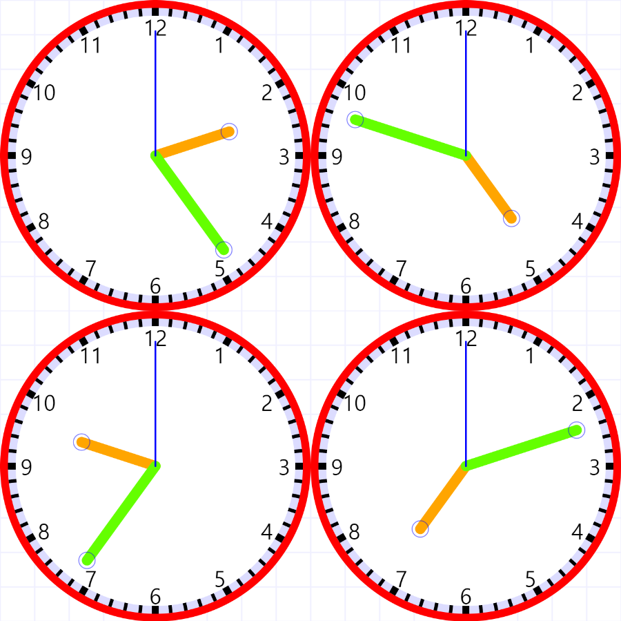

시계 수열
--------
시계 수열은 각 항이 12시간제의 한 시각으로 되어있는 수열이다.

시계 수열의 어떤 항의 분침에 해당하는 위치에 시침이 정확히 오도록 하는 시각이 다음 항이 된다.

### 예

 

5시 34분을 가르키는 한 항의 다음 항은 34분에 해당하는 분침의 위치에 시침이 오도록 하는 시각으로,

 

6시 48분이 된다.

 

Image by [Interactive Teaching Clock](http://www.visnos.com/demos/clock)

### 순환성

시계 수열은 항상 순환 수렴하게 된다.

어떤 시각으로 시작해도 (정각으로 시작하면 분침이 0을 가르키므로 제외) 항상

2:24 -> 4:48 -> 9:36 -> 7:12 -> 2:24 -> ...

의 순으로 순환하게 수렴한다.

 

위에서 예를 든 5시 34분은

5:34 -> 6:48 -> 9:36 -> 7:12 -> 2:24 -> ...

으로 수렴한다.

 

참고:

